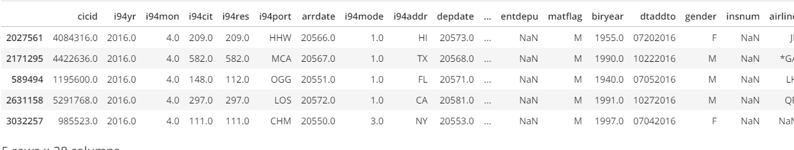

# us_immigrations

## Introduction

The purpose of this project is to implement an optimized data model by way of a star schema on non-immigrants who entered the United States in 2016.
The resulting tables would allow for analysis such as the type of work they would perform in the US, or in which city is most preferred by non-immigrants or which are the countries of origin of non-immigrants, etc..

## Steps for building the data model
### Datasets Used
1. US-I94 Immigration data: This data comes from the US National Tourism and Trade Office. Check this https://travel.trade.gov/research/reports/i94/historical/2016.html for more details.

2. Global temperature: This data is from [here](https://www.kaggle.com/berkeleyearth/climate-change-earth-surface-temperature-data)
3. Airport codes:  This data is from opendatasoft, check [here](https://public.opendatasoft.com/explore/dataset/us-cities-demographics/export/) for more details.
4. US cities demographics: Data about US cities is from [here](https://datahub.io/core/airport-codes#data)

