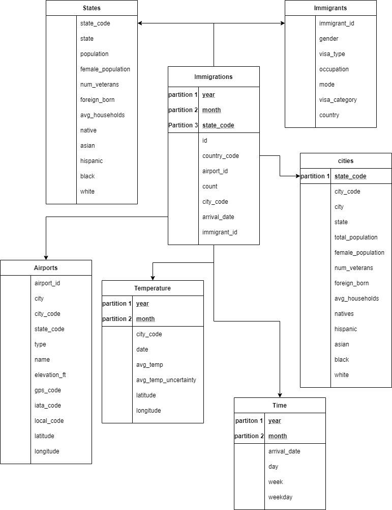

# us_immigrations

## Introduction

The purpose of this project is to implement an optimized data model by way of a star schema on non-immigrants who entered the United States in 2016.
The resulting tables would allow for analysis such as the type of work they would perform in the US, or in which city is most preferred by non-immigrants or which are the countries of origin of non-immigrants, etc..

## Steps for building the data model
### Datasets Used
1. US-I94 Immigration data: This data comes from the US National Tourism and Trade Office. Check this https://travel.trade.gov/research/reports/i94/historical/2016.html for more details. Below is the sample of the data:

2. Global temperature: This data is from [here](https://www.kaggle.com/berkeleyearth/climate-change-earth-surface-temperature-data)
3. Airport codes:  This data is from opendatasoft, check [here](https://public.opendatasoft.com/explore/dataset/us-cities-demographics/export/) for more details.
4. US cities demographics: Data about US cities is from [here](https://datahub.io/core/airport-codes#data)

### Steps

**Step 1:** To extract the relevant code data from I94 label description file, which could later on be used to create relationships between table

**Step 2:** Perform aggregation on US cities data to create data about US states, and calculate some metrics like proportion of each race in a state, average number of households in a state.

**Step 3:** Combine city code from labels file with temperature data, so that an analysis of temperature with immigration trends could be made

**Step 4:** Extracting relevant columns from datasets which would assist in analysis, such as gender, arrival date, age, purpose of visit, etc. of an immigrant

Note: some data preparatory steps like dropping duplicates, populating facts and dimension table with unique id were also perfomed.

### Final Data Model
Finally the following STAR SCHEMA has been obtained:



### What if scenarios

1. If the data were increased by 100x: In this case it would make sense to increase the nodes in the EMR Cluster, or we could use an MPP data store like Cassandra to quickly write in the incoming data and then use Spark to process data into Star Schema.

2. If the pipelines would be run on a daily basis by 7 am every day: in this case it would make sense to use a workflow manager like Airflow where we could schedule triggers for Spark jobs.

3. If the database needed to be accessed by 100+ people: this scenario is perfect for using a database like Redshift. I would recommed moving from parquet to Redshift in this case.

### Tools Used

For this project the following tools were used:

1. Spark: to process big tables like immigrations, immigrants, and to perform big joins as these would overflow the system RAM and a distributed tool like Spark is well suited for these jobs

2. Pandas: To process small, medium data like states (50 states in the US), or US temperature data (used 190 Mb of RAM)

### To execute

To execute the script, please set the AWS configuration in config.cfg files properly. Also make sure paths to datasets and output directory are properly set. A config_template.cfg file is provided, rename that to `config.cfg` and set the values

Copy the project to EMR or clone the [git repo](https://github.com/sahil350/us_immigrations) and execute

```
spark-submit src/etl.py
```
